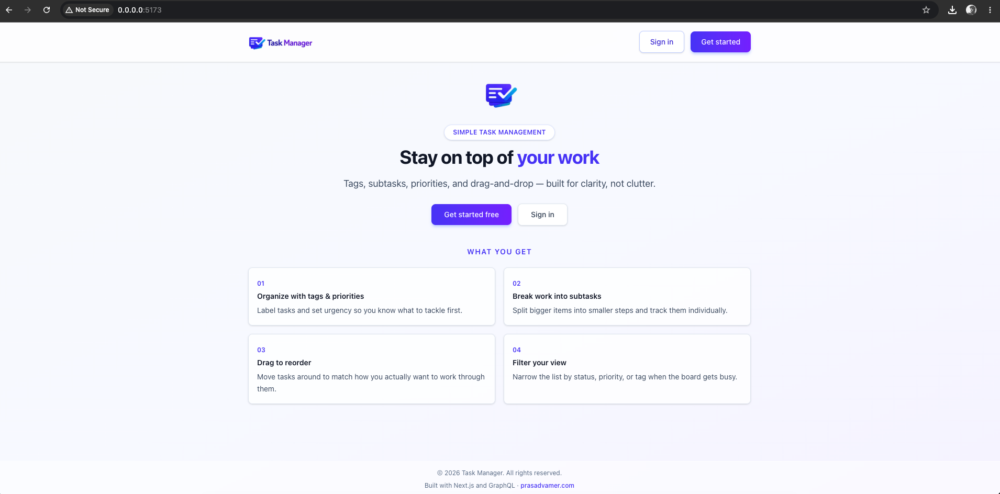
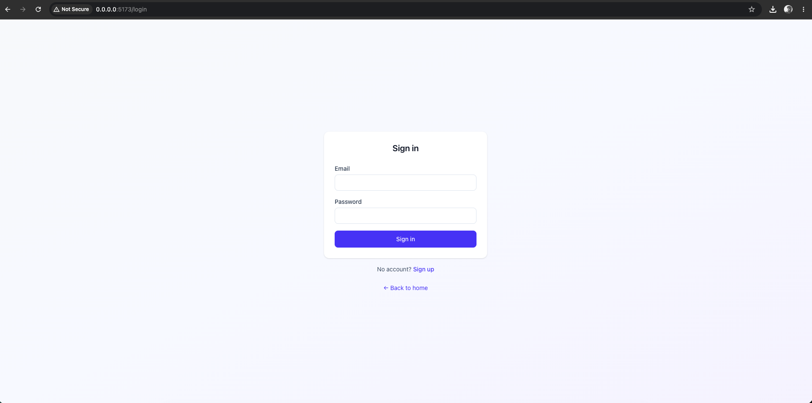
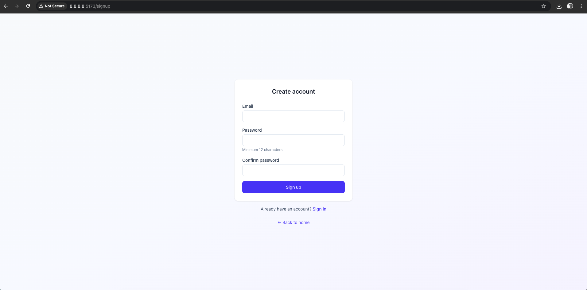
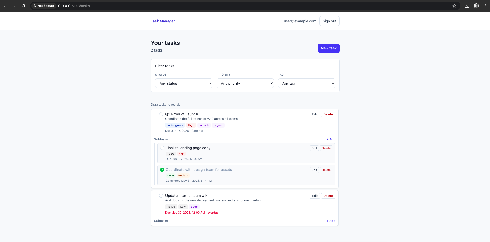

# Task Manager — Backend

Rails 8 GraphQL API for a full-stack task manager app. Pairs with the [frontend repo](https://github.com/prasadvamer/task_manager_app_frontend).



---

## Stack

- **Ruby 4 / Rails 8.1**
- **PostgreSQL**
- **graphql-ruby** — single `/graphql` endpoint, no REST
- **bcrypt** — password hashing via `has_secure_password`
- **Rack::Attack** — rate limiting on auth endpoints
- **RSpec + FactoryBot** — test suite
- **Docker + Kamal** — local dev and deployment

---

## What's implemented

### Auth

Session-based auth with signed HttpOnly cookies — no JWT. Sessions are stored in a `sessions` table and carry user agent and IP on creation. The `Current` model (thread-local) holds the resolved user for the duration of each request.




- `signUp` — creates user with bcrypt-hashed password, minimum 12 characters enforced at the model level
- `signIn` — verifies credentials, writes session cookie
- `signOut` — destroys the session record and clears the cookie
- Emails are normalised to lowercase before save

### Tasks



Full CRUD plus a few extras:

- `createTask` — title, description, due date, priority, status, tags, optional `parentId` for subtasks
- `updateTask` — partial updates, only passed fields are changed
- `deleteTask` — cascades to subtasks and cleans up orphaned tags
- `toggleTaskComplete` — flips status and stamps/clears `completed_at`
- `reorderTask` — atomic position update; uses a DB-level lock on siblings inside a transaction to avoid race conditions during concurrent drag-and-drop

### Subtasks

Tasks are self-referential via `parent_id`. Subtasks support the full task lifecycle — create, update, delete, complete, reorder within their parent.

### Tags

- Many-to-many between tasks and tags via a `task_tags` join table
- Tags are scoped per user — unique on `(user_id, name)`
- Normalised to lowercase on write
- Orphan cleanup runs after every `updateTask` and `deleteTask` — tags with no remaining tasks are destroyed automatically

### Filtering

The `tasks` query accepts optional `status`, `priority`, and `tagId` arguments — combinable, all optional.

---

## GraphQL schema overview

```
Query
  me                             → current user
  tasks(status, priority, tagId) → top-level tasks with optional filters
  task(id)                       → single task
  tags                           → all tags for current user

Mutation
  signUp / signIn / signOut
  createTask / updateTask / deleteTask
  toggleTaskComplete
  reorderTask
  deleteTag
```

---

## Running locally

Both repos need to sit in the same parent folder — the Docker Compose file references the frontend by relative path.

```bash
git clone https://github.com/prasadvamer/task_manager_app_backend
git clone https://github.com/prasadvamer/task_manager_app_frontend

cd task_manager_app_backend
docker compose up --build
```

Backend runs on `http://localhost:3000`, frontend on `http://localhost:5173`.

---

## Tests

```bash
docker compose exec app bundle exec rspec
```

Coverage includes model specs (task reordering, tag sync, validations) and request specs for all GraphQL mutations and queries.

---

## CI Workflows

There's a GitHub Actions workflow that runs on every PR against main. It spins up 3 jobs in parallel: a security scan (brakeman + bundler-audit), a lint check (rubocop), and the full rspec suite. All three have to pass before the PR can merge.

The workflow runs on a self-hosted runner rather than GitHub-hosted — the runner image is something I built and published myself: [prasadvamer/github-selfhosted-runner](https://hub.docker.com/r/prasadvamer/github-selfhosted-runner) on Docker Hub.
